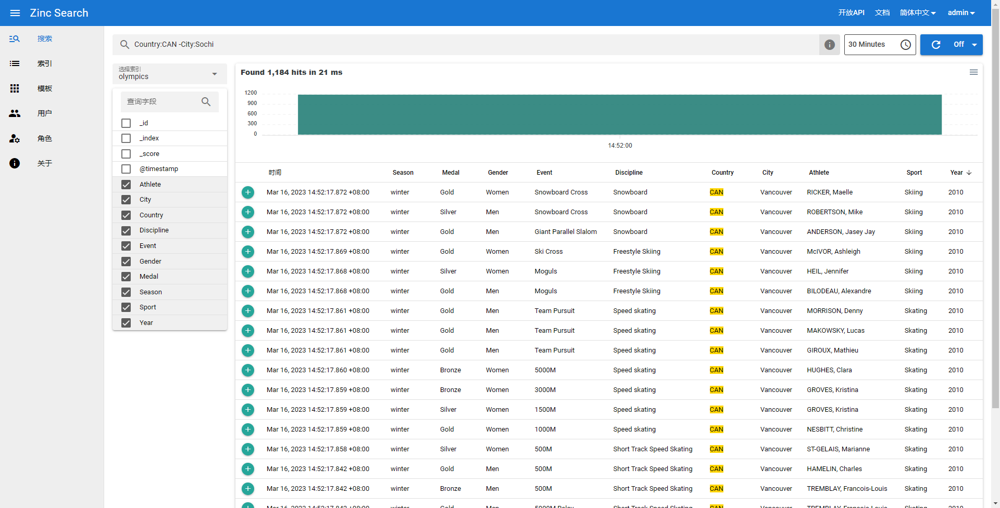

# zinc
https://docs.zinc.dev/quickstart/

<pre>
mkdir zinc
chmod 777 zinc

docker run --rm -it -v $PWD/zinc:/data -e ZINC_DATA_PATH="/data" -p 4080:4080 \
    -e ZINC_FIRST_ADMIN_USER=admin -e ZINC_FIRST_ADMIN_PASSWORD=P@ssw0rd \
    --name zinc public.ecr.aws/zinclabs/zinc:latest

curl -L https://github.com/zinclabs/zinc/releases/download/v0.1.1/olympics.ndjson.gz -o olympics.ndjson.gz
gzip -d  olympics.ndjson.gz 

curl http://localhost:4080/api/_bulk -i -u admin:P@ssw0rd  --data-binary "@olympics.ndjson"
</pre>

